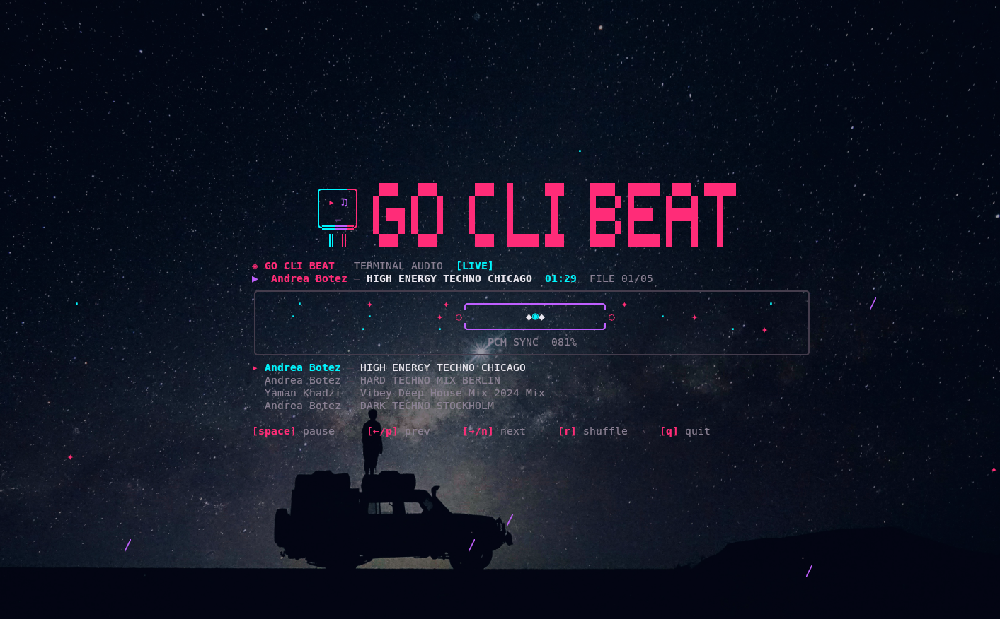

# GO CLI BEAT

---

GO CLI BEAT is a music player designed for the terminal.
It keeps local music libraries close to the command line.
Track names work without embedded metadata.
Filenames written as `Artist - Title` are split for display.
The player scans folders and their nested album directories.
It continues past files that cannot be decoded.
The screen responds to the audio currently playing.
The central player remains stable while the surrounding scene reacts.
Playback controls stay available without leaving the terminal.

---

## See GO CLI BEAT in action



---

## Quickstart

### Install

```bash
chmod +x install.sh && ./install.sh
```

### Run

```bash
# Use a music directory directly.
./go-cli-beat /path/to/your/music

# Or run with the music_dir value in config.json.
./go-cli-beat
```
