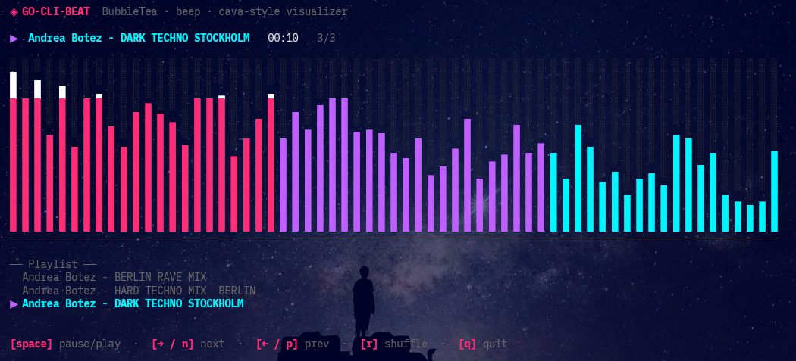

# go-cli-beat

A terminal music player written in Go with a **cava-style frequency bar visualizer**.  
Built with [BubbleTea](https://github.com/charmbracelet/bubbletea), [lipgloss](https://github.com/charmbracelet/lipgloss), and [gopxl/beep](https://github.com/gopxl/beep).



## Installation

### 1. System dependencies

**Ubuntu / Debian:**
```bash
sudo apt install -y libasound2-dev gcc
```

**Fedora / RHEL:**
```bash
sudo dnf install -y alsa-lib-devel gcc
```

**Arch Linux:**
```bash
sudo pacman -S alsa-lib gcc
```

### 2. Build

```bash
cd go-cli-beat
go mod tidy
go build -o go-cli-beat .
```

Or use the helper script:
```bash
chmod +x install.sh && ./install.sh
```

### 3. Configure

Edit `config.json` (located next to the binary) to point to your music folder:

```json
{
  "music_dir": "/home/yourname/Music"
}
```

The file is created automatically with a default value if it does not exist.

### 4. Run

```bash
# Uses the path from config.json
./go-cli-beat

# Override with a CLI argument (does not modify config.json)
./go-cli-beat /path/to/music
```

## Controls

| Key | Action |
|-----|--------|
| `Space` | Pause / Resume |
| `→` or `n` | Next track |
| `←` or `p` | Previous track |
| `r` | Re-shuffle playlist |
| `q` | Quit |

## Bad MP3 files

Some MP3 files use non-standard encodings (free-bitrate, malformed headers, etc.)
that cannot be decoded by the pure-Go MP3 library.  
When this happens, go-cli-beat **automatically skips** the file and shows a brief
warning at the bottom of the screen — it does not crash.

If you need to play those files, re-encode them with ffmpeg:
```bash
ffmpeg -i "broken.mp3" -codec:a libmp3lame -q:a 2 "fixed.mp3"
```

## Project structure

```
go-cli-beat/
├── main.go                   # Entry point — loads config, starts BubbleTea
├── config.json               # User config (music_dir)
├── go.mod
├── install.sh
└── internal/
    ├── config/
    │   └── config.go         # JSON config load/save
    ├── audio/
    │   └── audio.go          # Speaker init, MP3 decode, play/pause/stop
    ├── visualizer/
    │   └── visualizer.go     # Cava-style bar physics (attack/decay, beat pulse)
    ├── player/
    │   ├── player.go         # BubbleTea Model — state, Update, commands
    │   └── view.go           # View() — delegates to ui package
    └── ui/
        └── ui.go             # Lipgloss rendering — bars, playlist, controls
```

## How the visualizer works

- **Spectral envelope** — bars are weighted by position: dominant bass (left), mid
  presence (centre), soft highs (right), mimicking a real frequency spectrum.
- **Beat pulse** — a ~130 BPM impulse boosts the bass bars periodically.
- **Cava-style smoothing** — attack is fast (0.60 coefficient), decay is slow (0.12),
  giving that characteristic trailing-down look.
- **Colours** — pink (bass) → violet (mids) → cyan (highs), white at peaks.
